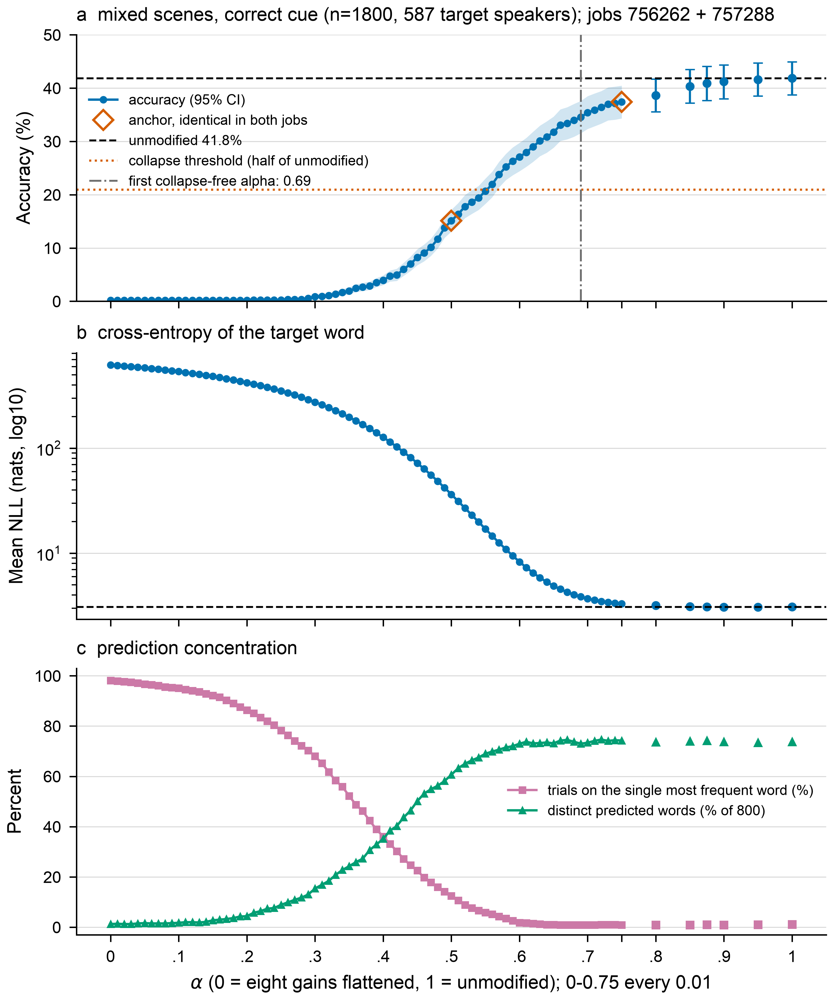
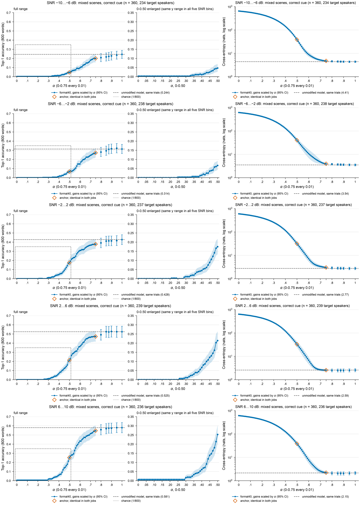

# α从0到1的完整曲线：作业756262 + 757288合并读数

日期：2026-09-29。状态：`FINE_ALPHA_COMBINED_DESCRIPTIVE_READOUT_NOT_AGE_MAPPED`。

两个作业合起来覆盖82个α点：
- 0–0.75每0.01一点，共76点；
- 另有0.80、0.85、0.875、0.90、0.95、1。

0–0.50段与0.875、1来自756262（[50号文](50_FINE_ALPHA_READOUT_756262_20260929.md)），0.51–0.74与0.80–0.95来自757288（v4，[51号文](51_FINE_ALPHA_V4_GAP_FILL_PLAN_20260929.md)）。

> 研究身份：formal40单一模型、复用E1验证集、由已见结果驱动的**探索性**分析；不是独立测试，不做α到儿童年龄的映射。

## 1. 结论摘要

以下数字均为带正确提示的mixed场景，n=1800，587个目标说话人。

1. **两次作业可以直接拼接。** 0.50与0.75在两个作业中的全部12组数组逐位相同，trial_ids、logits、nll都一致；未改动模型（original pass）在两个作业中也逐位相同。
2. **整条曲线呈S形，82个点单调不减。**
   - 0–0.20：几乎为0（0.17%）；
   - 0.30起开始上升；
   - 0.45–0.63：陡升段，每0.01上升0.7–2.1个百分点，平均约1.2（0.45的8.2%→0.63的30.1%）；
   - 0.63以后逐渐放缓；
   - 0.75为37.4%，0.90为41.2%，1为41.8%（未改动模型）。
3. **崩溃边界在0.68与0.69之间。** 按E1合同的两条判据分别看：
   - 准确率低于原模型一半：0.55仍符合，0.56起不再符合（0.56为21.9%，阈值20.9%）；
   - 最大|logit|超过原模型10倍（709）：0.68仍符合（838），0.69起不再符合（677）；
   - 两条合起来，**0.69起才不再判为崩溃**。
4. **恢复程度的持续起点**：定义为“此后所有点都不低于该水平”的最小α。区间来自目标说话人bootstrap。

   | 水平 | 起点α | 95%区间 |
   |---|---:|---|
   | 1% | 0.32 | [0.30, 0.34] |
   | 10% | 0.47 | [0.46, 0.49] |
   | 原模型的50%（20.9%） | **0.56** | [0.54, 0.57] |
   | 原模型的75%（31.4%） | **0.65** | [0.63, 0.67] |
   | 原模型的90%（37.6%） | **0.80** | [0.72, 0.85] |

   最陡的一步是0.48→0.49（+2.1个百分点），bootstrap区间覆盖0.47–0.57。最陡处恰好在两个作业的衔接附近，这一点只有补齐0.50–0.75后才看得出来。
5. **提示收益随α平稳增长，没有突变。** 400条配对对照上，“正确−打乱”依次为：0.50 +6.3，0.60 +11.3，0.70 +19.0，0.80 +22.8，1 +30.8个百分点，每个点的区间下界都大于0。

## 2. 核验

| 核验 | 结果 |
|---|---|
| 757288收集与离线验收 | 240个文件哈希核验通过；`FINE_ALPHA_ARTIFACTS_VERIFIED`，122,400条预测 |
| 读数前重跑两个作业的冻结包offline-check | 均通过（219,600 / 122,400条） |
| 0.50、0.75对接点（6条件×2） | 12组数组逐位相同（`V4_ANCHORS_BITWISE_EQUAL_756262`） |
| 未改动模型跨作业 | 6个条件逐位相同 |
| 两作业所用题库 | 文件哈希相同 |
| 757288内部 | 两进程冷重复逐位相同；与750474的α=1对接逐位相同；每个pass的G5公式核验均通过 |
| 独立盲重算 | 另一个代理未看分析代码，从原始数组自写代码重算。以下结果与本文**完全一致**：570个数组SHA；对接点与未改动模型的跨作业一致性；0.30–1各点的准确率、NLL、最大\|logit\|；两条崩溃边界0.56和0.69；50%/75%/90%起点0.56、0.65、0.80；82点0次下降；SNR分档表；提示收益 |

结果目录：[readout-combined-756262-757288-eq581r9c](release_fine_alpha_20260929_candidate_v4/readout-combined-756262-757288-eq581r9c/REPORT.json)。其中：
- `REPORT.json`：全部统计、来源SHA、对接点逐行结果；
- `CURVE.csv`：82点逐行表，每行标明来自哪个作业；
- `figures/`：主图，以及按SNR分档的10张图（A版加0–0.50放大，另有 `ALL_10_overview.png` 拼版）。

## 3. 主曲线（图）

| α | 准确率 % [95%] | 平均NLL | 同一个词占比 | 最大\|logit\| | 崩溃判据（准确率/logit） | 来源 |
|---:|---|---:|---:|---:|:---:|:---:|
| 0.50 | 15.11 [13.08, 17.17] | 36.36 | 12.4% | 2451 | 是/是 | 两者相同 |
| 0.55 | 20.67 [18.29, 23.03] | 17.04 | 5.8% | 2275 | 是/是 | 757288 |
| 0.56 | 21.94 [19.53, 24.33] | 14.63 | 5.2% | 2223 | 否/是 | 757288 |
| 0.60 | 27.06 [24.40, 29.73] | 8.29 | 1.8% | 1944 | 否/是 | 757288 |
| 0.65 | 31.72 [28.81, 34.65] | 4.89 | 1.0% | 1359 | 否/是 | 757288 |
| 0.68 | 33.94 [30.87, 37.04] | 4.04 | 0.9% | 838 | 否/是 | 757288 |
| 0.69 | 34.56 [31.54, 37.60] | 3.85 | 0.9% | 677 | 否/否 | 757288 |
| 0.70 | 35.39 [32.34, 38.49] | 3.71 | 0.9% | 582 | 否/否 | 757288 |
| 0.75 | 37.39 [34.31, 40.46] | 3.30 | 0.9% | 120 | 否/否 | 两者相同 |
| 0.80 | 38.61 [35.55, 41.70] | 3.18 | 0.9% | 73 | 否/否 | 757288 |
| 0.90 | 41.22 [38.00, 44.37] | 3.08 | 0.9% | 71 | 否/否 | 757288 |
| 1 | 41.83 [38.74, 44.92] | 3.09 | 1.1% | 71 | 否/否 | 756262 |

- “答案集中到同一个词”（类别697）在0.60降到约2%，0.65以后与原模型相当（约1%）。
- 平均NLL从0.50的36.4降到0.69的3.85，此后接近原模型的3.09。
- 最大|logit|从0.50到0.75持续下降，但到0.69才跌破10倍阈值。所以两条判据给出的边界不同：0.56起准确率已不算崩溃，logit幅度到0.69才恢复正常。

## 4. 按SNR分档（导师要求的10张图）

每档n=360（mixed场景，正确提示）。准确率图纵轴五档统一为0–0.7，右侧为0–0.50放大（纵轴0–0.35）；交叉熵图为对数刻度。

| SNR (dB) | α=0.50 | 0.60 | 0.70 | 0.75 | 1 | 恢复到本档原模型50%的起点 | 75%的起点 |
|---|---:|---:|---:|---:|---:|---:|---:|
| −10…−6 | 0.047 | 0.097 | 0.181 | 0.200 | 0.244 | 0.63 | 0.71 |
| −6…−2 | 0.067 | 0.150 | 0.244 | 0.272 | 0.314 | 0.61 | 0.69 |
| −2…2 | 0.175 | 0.308 | 0.367 | 0.378 | 0.428 | 0.52 | 0.64 |
| 2…6 | 0.214 | 0.364 | 0.464 | 0.472 | 0.525 | 0.52 | 0.63 |
| 6…10 | 0.253 | 0.433 | 0.514 | 0.547 | 0.581 | 0.54 | 0.62 |

- 按各档自己的原模型准确率计，**两个低SNR档的恢复晚约0.07–0.11**：到50%的起点为0.61–0.63，高SNR档为0.52–0.54。
- 各档的交叉熵曲线形状相近，α=0时都在约600 nats，0.75以后回到各档原有水平（2.2–4.4 nats）。
- 以上为点估计，没有做档间比较的检验，属探索性观察。

## 5. 提示效应

| α | 0.50 | 0.55 | 0.60 | 0.65 | 0.70 | 0.75 | 0.80 | 0.90 | 1 |
|---|---:|---:|---:|---:|---:|---:|---:|---:|---:|
| 正确−打乱（400条配对，pp） | +6.3 | +8.3 | +11.3 | +13.8 | +19.0 | +21.5 | +22.8 | +28.3 | +30.8 |
| clean：正确提示−零提示（200条，pp） | −0.5 | −7.5 | −10.5 | **−16.0** | −11.5 | −7.5 | −2.5 | −5.0 | −3.0 |

- 对照子集上，提示收益从0.50到1平稳增长，表中每个点的逐点区间下界都大于0（0.50为[3.3, 9.2]，1为[25.8, 35.6]）。
- **clean单说话人输入上出现反向效应**：在0.55–0.75之间，给正确提示反而比零提示准确率低，逐点区间都在0以下。例如0.65时为−16.0 [−23.2, −9.0]，0.70时为−11.5 [−18.8, −4.7]。到0.80以后缩小到−2.5至−5.0，区间大多跨过0。756262已在0.75–0.875观察到类似的负值，本次补点显示负值在过渡段最大。这是描述性结果，没有测中间层，不作机制解释。

## 6. 错误结构（mixed，1800条）

| α | 目标词 | 干扰者词 | 提示词本身 | 其他词 |
|---:|---:|---:|---:|---:|
| 0.50 | 272 | 115 | 6 | 1407 |
| 0.60 | 487 | 131 | 1 | 1181 |
| 0.70 | 637 | 120 | 0 | 1043 |
| 1 | 753 | 35 | 1 | 1011 |

在0.5–0.7的过渡段，干扰者词的错误维持在115–131条，约为α=1时（35条）的3–4倍；到α=1才明显下降。

## 7. 与之前结论的关系

- E0/E1“α≤0.5时失效”的结论成立，本次把边界精确到**0.68–0.69**（两条判据合并），按准确率判据单独看是0.55–0.56。
- 50号文的推断得到证实：0.50–0.75段包含曲线的大部分上升和崩溃边界。0.50处的斜率确实大于空档的平均斜率，曲线在0.63左右开始放缓。
- 0.75–1之间曲线平缓（0.75的37.4% → 1的41.8%），新增的0.80–0.95四点没有出现意外起伏。

## 8. 解释边界

- 探索性开发分析：单一formal40模型，复用E1验证集，由已见结果驱动。
- 所有区间都是逐点区间，没有做多重比较校正；持续起点、最陡步和崩溃边界都是事后定义的描述量，不是阈值检验。
- 两条崩溃判据得出的边界不同（0.56对0.69），报告时应说明用的是哪一条。
- target_speaker聚类没有吸收提示、干扰者、打乱来源共享造成的全部依赖。
- **不做α到儿童年龄的映射**。

## 9. 文件

| 文件 | 作用 |
|---|---|
| `fine_alpha_combined.py` | 82点合并统计（崩溃边界、持续起点、最陡步、SNR分档、提示与错误结构） |
| `analyze_fine_alpha_combined.py` | 先对两个作业分别重跑offline-check并核对对接点，再计算 |
| `make_fine_alpha_combined_figures.py` | 主图与SNR分档10张图 |
| `fine_alpha_v4_anchor.py` | 0.50/0.75对接点逐位比对 |
| `test_fine_alpha_combined.py`、`test_fine_alpha_v4_anchor.py` | 测试 |
